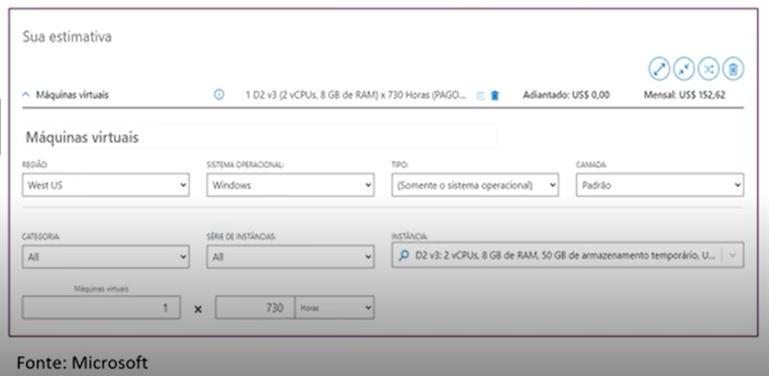
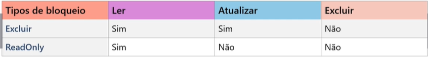

# Resumo para preparação para a AZ-900
---

📘 AZ-900 – Fundamentos de Cloud (Microsoft Azure)

Este repositório foi criado com o objetivo de registrar estudos e atividades práticas realizadas durante o curso preparatório para a certificação AZ-900 – Microsoft Azure Fundamentals.

Durante o desenvolvimento deste material, foram abordados conceitos fundamentais relacionados à computação em nuvem, incluindo:

---

## 📘 Módulo 1 – Conceitos de Cloud

---

### ☁️ Modelos de Nuvem
- Nuvem Pública  
- Nuvem Privada  
- Nuvem Híbrida  
- Diferenças, vantagens e cenários de utilização de cada modelo  

---

### 💰 Modelos de Custos em Cloud
- Conceito de CAPEX (Capital Expenditure)  
- Conceito de OPEX (Operational Expenditure)  
- Comparação entre custos tradicionais de infraestrutura e custos em computação em nuvem  

⚠️ Dica de prova:
CAPEX = investimento inicial alto  
OPEX = pagamento conforme uso  

---

### ⚙️ Assinaturas e Recursos no Azure
- Processo de criação de assinaturas  
- Organização e gerenciamento de recursos no Azure  
- Estrutura básica de governança na plataforma  

---

### 🚀 Benefícios da Computação em Nuvem

**Alta Disponibilidade**  
Serviços em nuvem oferecem altos níveis de SLA (Service Level Agreement), como 99%, 99,5% e 99,99%, garantindo maior tempo de disponibilidade. Em casos de descumprimento, pode haver compensações financeiras (estornos).

**Exemplo:**  
99% → ~7 horas de indisponibilidade/mês  
99,9% → ~43 minutos/mês  
99,99% → ~4 minutos/mês  

⚠️ Dica de prova:  
Alta disponibilidade NÃO significa zero downtime  

---

**Escalabilidade**  
Capacidade de aumentar ou reduzir recursos conforme a demanda, permitindo atender crescimento do sistema sem necessidade de investimento antecipado em infraestrutura.

---

**Elasticidade**  
Permite que os recursos sejam ajustados automaticamente para lidar com picos de uso inesperados, garantindo performance mesmo em situações não previstas.

⚠️ Dica de prova:  
Escalabilidade = planejado  
Elasticidade = automático  

---

**Segurança e Governança**  
Aplicação de políticas de acesso, controle de identidade e permissões, garantindo que apenas usuários autorizados tenham acesso aos recursos.

---

**Confiabilidade**  
Infraestrutura distribuída globalmente, com redundância e tolerância a falhas, garantindo maior estabilidade e continuidade dos serviços.

---

### 🧩 Tipos de Serviços em Cloud

**Infraestrutura como Serviço (IaaS)**  
Fornece recursos básicos de computação, como máquinas virtuais, redes e armazenamento. O usuário tem maior controle sobre o ambiente, sendo responsável por sistemas operacionais e aplicações.

➡️ Maior controle = mais responsabilidade  

---

**Plataforma como Serviço (PaaS)**  
Oferece um ambiente completo para desenvolvimento, testes e implantação de aplicações, sem a necessidade de gerenciar a infraestrutura.

➡️ Equilíbrio entre controle e facilidade  

---

**Software como Serviço (SaaS)**  
Disponibiliza aplicações prontas para uso via internet, sem necessidade de instalação ou gerenciamento técnico por parte do usuário.

➡️ Apenas uso da aplicação  

⚠️ Dica de prova:
IaaS → VM  
PaaS → App Service  
SaaS → Office 365  

---

### 🔐 Modelo de Responsabilidade Compartilhada

Na computação em nuvem, a responsabilidade pela segurança e gerenciamento dos recursos é dividida entre o provedor de nuvem e o cliente.

#### 🧱 Infraestrutura como Serviço (IaaS)

**Responsabilidade do Cliente:**
- Sistema operacional  
- Configurações de rede  
- Aplicações instaladas  
- Atualizações e patches  
- Dados  

**Responsabilidade do Provedor:**
- Datacenter físico  
- Hardware  
- Rede física  
- Virtualização  

➡️ Maior controle para o cliente, porém maior responsabilidade  

---

#### ⚙️ Plataforma como Serviço (PaaS)

**Responsabilidade do Cliente:**
- Aplicações desenvolvidas  
- Configuração das aplicações  
- Dados  

**Responsabilidade do Provedor:**
- Sistema operacional  
- Runtime  
- Middleware  
- Infraestrutura  

---

#### 💻 Software como Serviço (SaaS)

**Responsabilidade do Cliente:**
- Dados  
- Configuração de uso  

**Responsabilidade do Provedor:**
- Todo o restante  

⚠️ Dica de prova:
Quanto mais alto (SaaS), menos responsabilidade do cliente  

---

## 📘 Módulo 2 – Arquitetura do Azure

---

### 🏗️ Arquitetura do Azure

A arquitetura do Microsoft Azure é baseada em uma estrutura global distribuída.

---

### 🌎 Regiões

As regiões são conjuntos de datacenters localizados em diferentes áreas geográficas ao redor do mundo.

---

### 🌐 Pares de Regiões

➡️ Região secundária para recuperação  
➡️ Evita indisponibilidade simultânea  
➡️ Ajuda em disaster recovery  

---

### 🏢 Zonas de Disponibilidade

Datacenters fisicamente separados dentro da mesma região.

⚠️ Dica de prova:
Zona ≠ Região  

---

### 🛠️ Gerenciamento de Recursos

Management Groups → Subscriptions → Resource Groups → Resources  

---

### 📦 Assinaturas

➡️ Controle de cobrança  
➡️ Controle de acesso  

---

### 📁 Grupos de Recursos

➡️ Agrupamento lógico de recursos  
➡️ Gerenciamento em conjunto  

---

### 📌 Resumo

- Região → Local físico  
- Zona → Alta disponibilidade  
- Assinatura → Controle  
- Grupo → Organização  

---

### 💻 Computação e Rede no Azure

A computação no Azure é um serviço sob demanda que fornece recursos de computação, como discos, processadores, memória, rede e sistemas operacionais.

➡️ Permite criar, executar e escalar aplicações sem necessidade de infraestrutura física  

---

#### 🖥️ Serviços de Computação ####

---

**Máquinas Virtuais (Virtual Machines – VM)**  
Permitem criar servidores completos na nuvem.

➡️ Controle total do ambiente  

⚠️ Dica:
VM = IaaS  

---

**Conjunto de Dimensionamento de Máquinas Virtuais (VMSS)**  
Permite criar e gerenciar múltiplas VMs com escalabilidade automática.

➡️ Ideal para aplicações com variação de carga  
➡️ Suporta balanceamento de carga  

⚠️ Dica:
VMSS = ESCALA  

---

**Conjunto de Disponibilidade (Availability Set)**  
Distribui VMs para garantir disponibilidade.

➡️ Protege contra falhas  

⚠️ Dica:
Não escala  

---

**Área de Trabalho Virtual (Azure Virtual Desktop)**  
É um serviço de virtualização de desktops que permite executar uma área de trabalho (Windows) na nuvem, acessível remotamente por qualquer dispositivo.

➡️ O usuário acessa um desktop completo via internet  
➡️ Não depende da máquina local (tudo roda na nuvem)  
➡️ Pode ser utilizado para trabalho remoto e ambientes corporativos  

⚠️ Dica de prova:
- Azure Virtual Desktop ≠ VM comum  
- É focado em experiência de usuário Final (desktop remoto), já a VM geralmente é usado para ser Servidor 

---

**Containers no Azure**  
Fornecem um ambiente leve e virtualizado para execução de aplicações, sem necessidade de gerenciar o sistema operacional. (PaaS)

➡️ Inicialização rápida e baixo consumo de recursos  
➡️ Portabilidade entre ambientes (dev, teste e produção)  
➡️ Podem escalar rapidamente conforme a demanda  

⚠️ Dica de prova:
- Containers ≠ Máquinas Virtuais  
👉 Containers são mais leves e rápidos  
👉 VM inclui sistema operacional completo  

---

**Instâncias de Contêiner (Azure Container Instances – ACI)**  
Permite executar containers de forma rápida e simples, sem necessidade de gerenciar servidores.

➡️ Provisionamento em segundos  
➡️ Ideal para cargas simples ou temporárias  
➡️ Cobrança baseada no uso  

⚠️ Dica de prova:
ACI = simples e direto  
👉 Sem orquestração  

---

**Aplicativos de Contêiner (Azure Container Apps)**  
Plataforma para execução de aplicações modernas baseadas em containers, com escalabilidade automática.

➡️ Suporte a microserviços  
➡️ Escala automática (inclusive para zero)  
➡️ Integração com eventos  

⚠️ Dica de prova:
Container Apps = intermediário  
👉 Mais completo que ACI  
👉 Mais simples que AKS  

---

**Azure Kubernetes Service (AKS)**  
Serviço gerenciado que permite implantar, gerenciar e orquestrar containers utilizando Kubernetes.

➡️ Gerencia automaticamente a infraestrutura do Kubernetes  
➡️ Permite escalar aplicações em containers conforme a demanda  
➡️ Suporta alta disponibilidade e balanceamento de carga  
➡️ Ideal para aplicações complexas e arquiteturas de microserviços  

⚠️ Dica de prova:
AKS = orquestração de containers  
👉 Mais completo e poderoso  
👉 Também mais complexo de gerenciar  

Comparação rápida:

- ACI → simples (executa container)
- Container Apps → escalável e moderno
- AKS → completo (orquestra tudo)

---
**Azure Functions (PaaS)**  
Serviço de computação sem servidor (serverless) que permite executar código baseado em eventos, sem necessidade de gerenciar infraestrutura.

➡️ Código é executado apenas quando acionado (event-driven)  
➡️ Não há necessidade de manter servidor ativo  
➡️ Ideal para automações, integrações e tarefas sob demanda  

⚠️ Dica de prova:
- Serverless ≠ sem servidor  
👉 O servidor existe, mas é gerenciado pelo Azure  

- Você paga apenas quando o código é executado  

Exemplos de uso:
- Processamento de arquivos ao subir no storage  
- Integração entre sistemas  
- Execução de tarefas agendadas 

---

**Serviço de Aplicativos do Azure (Azure App Service – PaaS)**  
Plataforma totalmente gerenciada para criar, implantar e dimensionar rapidamente aplicações web e APIs.

➡️ Não é necessário gerenciar servidores ou infraestrutura  
➡️ Suporte a várias linguagens (.NET, Java, Node.js, Python, etc.)  
➡️ Integração com banco de dados, autenticação e serviços do Azure  
➡️ Escalabilidade automática conforme a demanda  

⚠️ Dica de prova:
- App Service = PaaS  
👉 Foco no código, não na infraestrutura  

- Muito usado para:
  👉 APIs  
  👉 Sistemas web  
  👉 Back-end de aplicações  

 Comparação rápida:

- App Service → aplicação web  
- Functions → execução por evento  

---

#### 🌐 Rede

---
** Rede Virtual (Azure Virtual Network – VNet)**

A VNet é o serviço de rede do Azure que permite criar uma rede privada na nuvem, semelhante a uma rede local (on-premises).

➡️ Permite comunicação segura entre recursos do Azure  
➡️ Isola recursos em uma rede privada  
➡️ Suporta comunicação com redes locais (VPN ou ExpressRoute)  

➡️ Dentro de uma VNet, é possível criar sub-redes (subnets) para organizar melhor os recursos  

**🔗 Emparelhamento de Redes (VNet Peering)**  
Permite conectar duas VNets diretamente, possibilitando comunicação entre elas como se estivessem na mesma rede.

➡️ Comunicação privada entre VNets  
➡️ Baixa latência e alta performance  
➡️ Não utiliza internet pública  

⚠️ Dica de prova:
- VNet = rede privada no Azure  
👉 Equivalente a uma rede interna (LAN)  

- Subnet = divisão da VNet  

- VNet Peering ≠ VPN  
👉 Peering é conexão direta dentro do Azure  
👉 VPN usa internet  

Exemplos de uso:
- Conectar API com banco de dados de forma segura  
- Isolar ambientes (produção, teste)  
- Integrar com rede local da empresa    

---
**🔐 VPN Gateway**

O VPN Gateway é um serviço do Azure que permite criar conexões seguras entre a rede do Azure (VNet) e redes externas, como a rede local da empresa ou dispositivos remotos.

➡️ Comunicação criptografada (segura)  
➡️ Conecta Azure com ambiente local (on-premises)  
➡️ Permite acesso remoto à rede do Azure  

**Site-to-Site (S2S)**  
➡️ Conecta a rede local inteira ao Azure  

**Point-to-Site (P2S)**  
➡️ Conecta dispositivos individuais (ex: notebook do usuário)  

⚠️ Dica de prova:
- VPN Gateway = conexão segura via internet  
👉 Usa criptografia  

- NÃO é conexão dedicada  
👉 Para conexão privada dedicada → ExpressRoute  

 Exemplos de uso:
- Empresa acessando sistemas no Azure com segurança  
- Funcionários acessando rede corporativa remotamente  
- Integração entre datacenter local e nuvem  

---

**⚡ ExpressRoute** 

O ExpressRoute é um serviço do Azure que permite criar uma conexão privada dedicada entre a rede local (on-premises) e o Azure, sem passar pela internet pública.

➡️ Conexão mais segura e estável  
➡️ Maior velocidade e menor latência  
➡️ Não utiliza a internet pública  

🔗 Características principais

➡️ Conexão dedicada (via operadora)  
➡️ Alta performance  
➡️ Alta confiabilidade  
➡️ Ideal para grandes empresas  

⚠️ Dica de prova:
- ExpressRoute ≠ VPN  

👉 VPN Gateway:
✔️ Usa internet  
✔️ Mais barato  
✔️ Mais simples  

👉 ExpressRoute:
✔️ Não usa internet  
✔️ Mais caro  
✔️ Mais rápido e estável  

Quando usar?

- Grandes volumes de dados  
- Sistemas críticos  
- Necessidade de baixa latência  
- Ambientes corporativos robustos  

----

**DNS do Azure (Azure DNS)**  

O Azure DNS é um serviço que permite hospedar e gerenciar domínios DNS no Azure, realizando a resolução de nomes para endereços IP.

➡️ Converte nomes de domínio (ex: www.site.com) em IPs  
➡️ Alta disponibilidade e desempenho global  
➡️ Gerenciamento simplificado de domínios  

⚠️ Dica de prova:
- DNS = resolução de nome → IP  

👉 Tipos:
- DNS Público → acessível pela internet  
- DNS Privado → utilizado dentro da VNet  

Exemplos de uso:
- Acessar aplicações pelo nome ao invés de IP  
- Comunicação interna entre serviços na rede  
- Configuração de domínios personalizados  

---

#### 💾  Serviços de Armazenamento (Storage) 

O Azure oferece serviços de armazenamento para guardar dados de forma segura, escalável e altamente disponível.

➡️ Pode armazenar arquivos, imagens, vídeos, backups, bancos de dados e logs  
➡️ Acesso via internet de qualquer lugar do mundo  
➡️ Alta durabilidade e redundância dos dados  

---

**📦 Contas de Armazenamento (Storage Accounts)**

A conta de armazenamento é o ponto central para utilizar os serviços de storage no Azure.

➡️ Deve ter um nome globalmente único  
➡️ Permite acesso via internet (HTTP/HTTPS)  
➡️ Define quais serviços serão utilizados (Blob, Files, Queue, Table)  
➡️ Define o tipo de redundância dos dados  

⚠️ Dica de prova:

Storage Account = “container principal” do armazenamento  
👉 Tudo começa por ela  

---

**🔁 Redundância de Armazenamento**

O Azure replica seus dados automaticamente para garantir alta disponibilidade.

Tipos principais:

- LRS (Locally Redundant Storage)  
➡️ Dados replicados dentro do mesmo datacenter  
👉 Mais barato, menor proteção  

- ZRS (Zone-Redundant Storage)  
➡️ Replicação entre zonas diferentes da mesma região  
👉 Protege contra falha de datacenter  

- GRS (Geo-Redundant Storage)  
➡️ Replicação para outra região (secundária)  
👉 Protege contra falha regional  

- GZRS (Geo-Zone-Redundant Storage)  
➡️ Combina ZRS + replicação para outra região  
👉 Maior nível de proteção  

OBS: Quanto mais "noves" melhor  

⚠️ Dica de prova:

- LRS = local  
- ZRS = zonas  
- GRS = outra região  
- GZRS = zonas + outra região (mais seguro)  

---

**📁 Tipos de Armazenamento**

Dentro da Storage Account, você pode usar diferentes serviços:

- Blob Storage → arquivos não estruturados (imagens, vídeos, backups)  
- File Storage → compartilhamento de arquivos (tipo rede)  
- Queue Storage → filas de mensagens  
- Table Storage → dados NoSQL simple  

---

**🌐 Pontos de Extremidade Públicos (Public Endpoints)**

Os serviços de armazenamento do Azure são acessados por meio de URLs públicas, chamadas de pontos de extremidade.

➡️ Permitem acesso via internet aos dados  
➡️ Utilizam HTTP ou HTTPS  
➡️ São gerados automaticamente ao criar a Storage Account  

🔒 Segurança

Mesmo sendo públicos, o acesso não é aberto automaticamente:

➡️ Pode exigir chave de acesso ou SAS (Shared Access Signature)  
➡️ Pode ser restrito por firewall  
➡️ Pode usar redes privadas (Private Endpoint) para maior segurança  

⚠️ Dica de prova:

- Endpoint = URL de acesso ao storage  
- Cada tipo de serviço tem seu próprio endpoint  
- Mesmo sendo público, não significa acesso liberado  

---

**📊 Camadas de Acesso (Access Tiers)**

As camadas de acesso no Azure Storage definem com que frequência os dados são acessados e ajudam a otimizar custos.

➡️ Quanto mais acesso → mais caro o armazenamento, mais barato o acesso  
➡️ Quanto menos acesso → mais barato o armazenamento, mais caro o acesso  

🔥 Frequente (Hot)  
🌤️ Esporádico (Cool)  
❄️ Frio (Cold)  
🧊 Arquivo Morto (Archive) ⚠️ (não é acesso imediato)  

---

**🚚 Migração para o Azure**

A migração de dados para o Azure pode ser feita de diferentes formas, dependendo do volume de dados e da conectividade disponível.

➡️ Via internet (upload)  
➡️ Via ferramentas de migração  
➡️ Via transferência física  

📦 Azure Data Box (Transferência Física)

O Azure Data Box é um dispositivo físico fornecido pela Microsoft para transferir grandes volumes de dados para o Azure.

➡️ Capacidade de até 80 TB de dados  
➡️ Ideal para grandes volumes onde a internet é limitada ou lenta  
➡️ Dados são copiados localmente e enviados fisicamente para o Azure  

🚛 Como funciona

- Solicita o Data Box pelo portal Azure  
- Microsoft envia o dispositivo físico  
- Você copia os dados para o equipamento  
- Envia de volta para a Microsoft  
- Dados são carregados no Azure automaticamente  

🔒 Segurança

➡️ Dados protegidos durante o transporte  
➡️ Criptografia integrada  
➡️ Dispositivo robusto contra danos físicos  

🎯 Quando usar

- Migração inicial de grandes volumes  
- Backup de recuperação de desastre (DR)  
- Ambientes sem boa conectividade  
- Locais remotos  

⚠️ Dica de prova:

- Data Box = transferência física (offline)  
- Usado quando internet não é suficiente  
- Muito comum em cenários de migração inicial

---

**📂 Opções de gerenciamento de arquivos**

1) azcopy

- Utilitário de linha de comando  
- Copia blogs ou arquivos de ou para sua conta de armazenamento  
- Sincronização em uma direção  

2) Gerenciamento de armazenamento do azure

- Interface gráfica (semelhante ao win explore)  
- Compatível com Win, Mac, Linux  
- Basicamente é uma interface para o azcopy  
3) sincronização de arquivos do azure

- Sincroniza os arquivos do azure e locais (on promise) de forma bilateral  
- A camada de nuvem mantém os arquivos acessados frequêntimente no local, e os poucos acessos libera espaço  

⚠️ Dica de prova:

- AzCopy = linha de comando  
- Storage Explorer = interface gráfica  
- Azure File Sync = sincronização bidirecional (nuvem + local)

---

### 🔐 Identidade, Acesso e Segurança no Azure

No Azure, a gestão de identidade e segurança é feita principalmente pelo Microsoft Entra ID (antigo Azure AD), garantindo controle de acesso e proteção dos recursos.

➡️ Permite autenticação e autorização de usuários e aplicações
➡️ Centraliza o gerenciamento de identidades
➡️ Integra com aplicações locais e na nuvem

**🧩 Serviços de Diretório no Azure**

- Microsoft Entra ID (Azure AD)
➡️ Serviço de identidade baseado em nuvem
➡️ Usado para autenticação em apps, APIs e serviços do Azure
➡️ Suporta SSO, MFA e acesso condicional

- Microsoft Entra Domain Services
➡️ Fornece domínio gerenciado (sem precisar de AD local)
➡️ Compatível com protocolos tradicionais (LDAP, Kerberos, NTLM)
➡️ Ideal para aplicações legadas
➡️ Suporta SSO

---

**🔑 Métodos de Autenticação no Azure**

- MFA (Autenticação Multifator)
➡️ Exige mais de uma forma de verificação (senha + código, biometria etc.)
➡️ Aumenta significativamente a segurança

- SSO (Single Sign-On)
➡️ Permite acessar vários sistemas com um único login
➡️ Melhora a experiência do usuário

- Autenticação sem senha (Passwordless)
➡️ Login via biometria, app autenticador ou chave de segurança
➡️ Reduz riscos de ataques com senha

---

**🌍 Identidades Externas e Convidados**

➡️ Permite convidar usuários externos (parceiros, clientes)
➡️ Usuários acessam recursos com suas próprias credenciais
➡️ Muito usado em colaboração entre empresas

👉 Exemplo: compartilhar acesso a um sistema com fornecedor

---

**🛡️ Controle de Acesso no Azure**

- Acesso Condicional (Conditional Access)
➡️ Define regras de acesso com base em condições
➡️ Exemplo: exigir MFA fora da empresa ou bloquear acesso por país

- RBAC (Controle baseado em função)
➡️ Permissões baseadas em papéis (roles)

➡️ Exemplo:
- Leitor (read-only)
- Colaborador (criar/editar)
- Administrador (controle total)

---

**⚠️ Dica de prova:**

- Entra ID = identidade e autenticação no Azure
- MFA = mais segurança (sempre cobrado)
- SSO = um login para vários sistemas
- RBAC = controla “o que o usuário pode fazer”
- Acesso Condicional = controla “quando e como pode acessar”

---

#### 🔐 Autenticação vs Autorização

**Autenticação (Authentication)**  
➡️ É o processo de verificar **quem você é**  
➡️ Valida a identidade do usuário  

👉 Exemplo:  
- Login com usuário e senha  
- Login com MFA (código no celular)  
- Login com biometria  

---

**Autorização (Authorization)**  
➡️ É o processo de verificar **o que você pode acessar**  
➡️ Define permissões após o login  

👉 Exemplo:  
- Usuário pode visualizar dados, mas não editar  
- Usuário pode acessar apenas um módulo do sistema  
- Administrador tem acesso total  

---

**🎯 Resumo rápido**

- **Autenticação = identidade (quem é você)**  
- **Autorização = permissão (o que você pode fazer)** 

**⚠️ Dica de prova:**

- Primeiro vem a **autenticação**, depois a **autorização**  
- No Azure:  
  - Entra ID → Autenticação  
  - RBAC → Autorização  

---

**🔐 Modelo de Confiança Zero (Zero Trust)**

O modelo de Confiança Zero é uma abordagem de segurança baseada no princípio de **nunca confiar, sempre verificar**.

➡️ Nenhum usuário, dispositivo ou aplicação é confiável automaticamente  
➡️ Toda solicitação de acesso deve ser autenticada, autorizada e validada continuamente  
➡️ O objetivo é reduzir riscos de acessos indevidos e vazamentos de dados  

---

**🧩 Princípios do Zero Trust**

**Verificar explicitamente**  
➡️ Sempre autenticar e autorizar com base em todos os dados disponíveis  
➡️ Exemplo: identidade, localização, dispositivo e nível de risco  

**Usar o princípio do menor privilégio**  
➡️ Conceder apenas o acesso necessário para executar uma tarefa  
➡️ Evita permissões excessivas  

**Assumir violação**  
➡️ Considera que um ataque pode acontecer ou já aconteceu  
➡️ Por isso, segmenta acessos e monitora continuamente  

**☁️ Zero Trust no Azure**

➡️ Pode ser aplicado com Microsoft Entra ID, MFA, Acesso Condicional e RBAC  
➡️ Ajuda a proteger usuários, dispositivos, aplicações e dados  
➡️ É muito usado em ambientes híbridos e em nuvem  

**⚠️ Dica de prova:**

- **Zero Trust = nunca confiar, sempre verificar**  
- Mesmo estando “dentro da rede”, o acesso ainda deve ser validado  
- MFA, RBAC e Acesso Condicional ajudam a implementar esse modelo 

---

#### 🛡️ Microsoft Defender para Nuvem

O Microsoft Defender para Nuvem é um serviço que ajuda a proteger recursos no Azure, em ambientes híbridos e até em outras nuvens.

➡️ Fornece gerenciamento de postura de segurança (CSPM)  
➡️ Oferece proteção contra ameaças (workloads)  
➡️ Identifica vulnerabilidades e recomenda melhorias de segurança  

---

**🔍 Principais Funcionalidades**

**Gerenciamento de postura de segurança (CSPM)**  
➡️ Avalia continuamente o ambiente  
➡️ Gera recomendações para melhorar a segurança  
➡️ Atribui uma pontuação de segurança (Secure Score)  

**Proteção contra ameaças**  
➡️ Detecta atividades suspeitas em tempo real  
➡️ Protege recursos como máquinas virtuais, bancos de dados e containers  
➡️ Gera alertas de segurança  

---

**☁️ Ambientes Suportados**

➡️ Azure  
➡️ On-premises (local)  
➡️ Multicloud (AWS, GCP)  

---

**⚙️ Exemplos de Proteção**

➡️ Detectar tentativa de acesso suspeito a uma VM  
➡️ Identificar portas abertas indevidamente  
➡️ Alertar sobre configurações inseguras  

---

**⚠️ Dica de prova:**

- Defender para Nuvem = **segurança + proteção contra ameaças**  
- Secure Score = mede o nível de segurança do ambiente  
- Funciona não só no Azure, mas também em ambientes híbridos e multicloud  

---

## 📘 Módulo 3 – Gerenciamento e Governança Azure

---

### 💰 Gerenciamento de Custos no Azure  

####  📊 Fatores que afetam o preço  

**1) Tipo de recursos**  
➡️ Cada serviço tem um custo diferente (VM, Storage, Banco, etc.)  

**2) Consumo**  
➡️ Modelo pay-as-you-go (pague pelo uso)  
➡️ Quanto mais usa, mais paga  

**3) Manutenção**  
➡️ Atualizações, backups e suporte podem gerar custos adicionais  

**4) Área geográfica (impostos)**  
➡️ Preço varia por região  
➡️ Pode incluir impostos locais  

**5) Tráfego de rede**  
➡️ Entrada geralmente gratuita  
➡️ Saída de dados (egress) é cobrada  

**6) Assinatura**  
➡️ Diferentes tipos (gratuita, pay-as-you-go, enterprise)  
➡️ Podem oferecer descontos ou benefícios  

⚠️ **Dica de prova:**  
- Custos variam principalmente por **uso, região e tipo de recurso**  

---

####  🛒 Azure Marketplace  

➡️ Plataforma para encontrar, testar, comprar e implantar soluções prontas  
➡️ Aplicações e serviços de parceiros certificados  

⚠️ **OBS:**  
- Suporte é do **fornecedor**, não da Microsoft  

---

####  🧮 Calculadora de Preços  

➡️ Ferramenta para estimar custos no Azure  
➡️ Valores são apenas estimativas (podem variar)  

Configurações comuns:  
- Região  
- Camada (tier)  
- Modelo de cobrança (pay-as-you-go ou reserva)  
- Suporte  
- Ofertas/programas  
- Tipo de assinatura  

⚠️ **Dica de prova:**  
- Calculadora = **estimativa**, não valor real  

---

####  📉 Calculadora de Custo Total de Propriedade (TCO)  

➡️ Estima economia ao migrar para o Azure  
➡️ Compara:  
- Infraestrutura local (on-premises)  
- Custos na nuvem  

---

####  📈 Gerenciamento de Custos do Azure  

➡️ Permite monitorar e controlar gastos  

Inclui:  
- Relatórios de cobrança  
- Análise de custos  
- Previsão de gastos  
- Alertas de custo  

---

####  🏷️ Marcas (Tags)  

➡️ Metadados para organizar recursos  
➡️ Estrutura **nome:valor** (ex: centro-custo:001)  

Benefícios:  
- Organização lógica  
- Controle de custos  
- Relatórios mais detalhados  

⚠️ **OBS:**  
- Não são obrigatórias  
- Não são herdadas automaticamente  

⚠️ **Dica de prova:**  
- Tags = organização + controle de custos  

---

---

### 📊 Governança e Conformidade no Azure

A governança no Azure garante que os recursos estejam organizados, seguros, em conformidade e seguindo padrões definidos pela empresa.

---

#### 📌 Azure Policy

O Azure Policy ajuda a impor padrões organizacionais e avaliar a conformidade em escala.

➡️ Garante governança e consistência dos recursos  
➡️ Auxilia na conformidade regulatória, segurança, custos e gerenciamento  
➡️ Avalia e identifica recursos que não atendem às políticas definidas  

➡️ Possui definições e iniciativas integradas em categorias como:  
- Armazenamento  
- Rede  
- Computação  
- Segurança (Microsoft Defender)  
- Monitoramento  

**📊 Status das políticas:**
- `Compliant` → Em conformidade  
- `Non-compliant` → Fora de conformidade  
- `Remediation` → Em processo de correção  

**🧠 Exemplos:**
- Permitir apenas determinados tipos de máquinas virtuais  
- Exigir criptografia em contas de armazenamento  
- Restringir regiões específicas para criação de recursos  

---

#### 🔒 Bloqueios de Recursos (Resource Locks)

Os bloqueios protegem os recursos contra exclusão ou modificação acidental.

➡️ Podem ser aplicados em:  
- Assinatura  
- Grupo de Recursos  
- Recursos individuais  

**🔐 Tipos de bloqueio:**
- `Delete` → Impede exclusão  
- `ReadOnly` → Impede alterações (somente leitura)

⚠️ Dica de prova:
- `ReadOnly` é mais restritivo que `Delete`

---

#### 🛡️ Portal de Confiança do Serviço

O portal de confiança permite verificar como a Microsoft trata segurança, privacidade e conformidade.

➡️ Exibe certificações, auditorias e padrões seguidos  
➡️ Mostra como os dados são protegidos no Azure  
➡️ Útil para compliance (LGPD, ISO, etc.)  

---

#### 🧬 Microsoft Purview

O Microsoft Purview é uma solução de governança de dados, risco e conformidade.

➡️ Fornece uma visão unificada dos dados  
➡️ Funciona com dados locais, multinuvem e SaaS  
➡️ Ajuda a classificar, mapear e proteger dados  

**🔍 O que é possível fazer:**
- Identificar onde estão os dados  
- Controlar quem pode acessar ou alterar dados  
- Monitorar uso e movimentação de dados  

**🧠 Exemplo:**
- Saber quem pode alterar uma tabela específica  
- Visualizar permissões e acessos aos dados  

---

💡 Dica de prova:
- Azure Policy = regras (governança)  
- Resource Lock = proteção contra exclusão/edição  
- Purview = governança de dados  
- Trust Portal = transparência e compliance  

---

---

### ⚙️ Ferramentas de Gerenciamento e Implantação no Azure

O Azure oferece diversas ferramentas para gerenciar e implantar recursos, atendendo desde iniciantes até usuários avançados e automação.

---

### 🧰 Principais Ferramentas

**🌐 Portal do Azure**
➡️ Interface gráfica (GUI) acessada pelo navegador  
➡️ Fácil de usar e ideal para iniciantes  
➡️ Permite criar, gerenciar e monitorar recursos  

---

**💻 Azure PowerShell**
➡️ Ferramenta de linha de comando baseada em PowerShell  
➡️ Usada para automação e scripts  
➡️ Ideal para administradores Windows  

---

**🖥️ Azure CLI (Command Line Interface)**
➡️ Interface de linha de comando multiplataforma  
➡️ Funciona em Windows, Linux e Mac  
➡️ Muito usada para automação e DevOps  

---

**☁️ Azure Cloud Shell**
➡️ Shell baseado no navegador (rodando no próprio Azure)  
➡️ Já vem com Azure CLI e PowerShell configurados  
➡️ Não precisa instalar nada localmente  

---

#### 🌍 Azure Arc

➡️ Permite gerenciar recursos que estão fora do Azure  
➡️ Inclui servidores on-premises, outras nuvens (multicloud) 

🌍 Outras nuvens suportadas
- Amazon Web Services (AWS)
- Google Cloud Platform (GCP)

➡️ Centraliza o gerenciamento como se tudo estivesse no Azure  

💡 Exemplo:
- Gerenciar um servidor local como se fosse um recurso do Azure  

---

#### 🏗️ Azure Resource Manager (ARM)

➡️ É a camada de gerenciamento do Azure  
➡️ Permite criar, atualizar e excluir recursos  
➡️ Organiza recursos por grupos (Resource Groups)  

**📄 ARM Templates**
➡️ Arquivos no formato JSON  
➡️ Usados para implantar infraestrutura como código (IaC)  
➡️ Permitem criar vários recursos de forma automática e padronizada  

---

#### 🧬 Bicep

➡️ Linguagem da Microsoft para definir infraestrutura como código  
➡️ É uma evolução do ARM Template  

**Vantagens:**
- Sintaxe mais simples que JSON  
- Mais fácil de ler e escrever  
- Compila para ARM Template automaticamente  

💡 Resumo:
- ARM Template → JSON (mais complexo)  
- Bicep → mais simples e moderno  

---

💡 Dica de prova:
- Portal = interface gráfica  
- CLI / PowerShell = automação  
- Cloud Shell = terminal no navegador  
- ARM = gerenciamento + templates  
- Bicep = versão simplificada do ARM  
- Azure Arc = gerenciar fora do Azure  

---

---

### Ferramentas de Monitoramento do Azure

No Azure, as principais ferramentas de monitoramento cobradas no AZ-900 são o **Azure Advisor**, a **Integridade do Serviço do Azure (Azure Service Health)** e o **Azure Monitor**.

#### Azure Advisor

O **Azure Advisor** é como um assistente digital da nuvem. Ele analisa os recursos implantados no Azure e faz recomendações com base em boas práticas para otimizar o ambiente.

Ele atua em **5 áreas principais**:

- **Confiabilidade**
- **Segurança**
- **Desempenho**
- **Custo**
- **Excelência Operacional**

#### Integridade do Serviço do Azure

A **Integridade do Serviço do Azure (Azure Service Health)** é um conjunto de serviços que mantém você informado sobre problemas e eventos que podem afetar o Azure e também os seus recursos específicos.

Ela fornece informações sobre:

- **Incidentes**
- **Manutenções planejadas**
- **Avisos de integridade**

Dentro desse contexto, existe também o **Azure Status**, que mostra uma **visão global** da integridade dos serviços do Azure em todas as regiões.

#### Azure Monitor

O **Azure Monitor** é a ferramenta usada para coletar, analisar e agir com base em dados de telemetria.

Ele ajuda a maximizar a disponibilidade e o desempenho de aplicações e serviços, monitorando ambientes em nuvem e também ambientes locais ou híbridos.

Com o Azure Monitor, é possível acompanhar dados como:

- **Métricas**
- **Logs**
- **Eventos**
- **Rastreamentos**

---

### Dica para prova

A diferença entre eles costuma cair bastante:

- **Azure Advisor** = faz **recomendações**
- **Azure Service Health** = mostra **problemas e manutenções que afetam seus recursos**
- **Azure Status** = mostra o **status global do Azure**
- **Azure Monitor** = coleta e analisa **telemetria, métricas e logs**

---